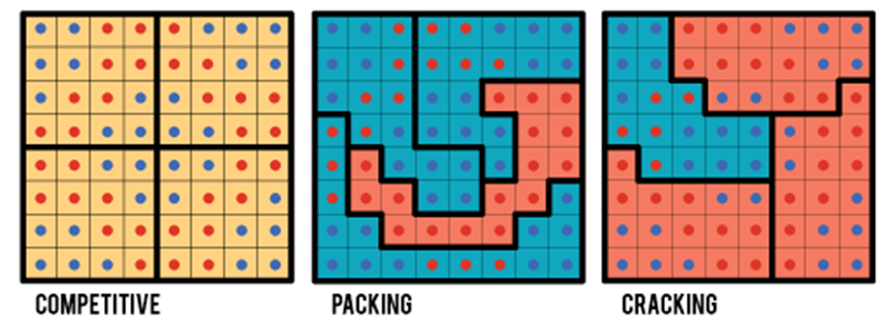

# UVM Undergraduate Research Work

## Overview

Throughout the Spring semester of 2025, I was fortunate enough to work a paid position as an Undergradute Research Assistant 
under Professor [Erkmen Aslim](https://www.linkedin.com/in/erkmen-g-aslim-48089637/) of the University of Vermont Department of Economics.
In conjunction with a team from the Department of Geography and Geosciences at UVM, we conducted the preliminary research to undertake 
a project to uncover the potential ramifications of adding a new race category to the 2030 United States Census. The ultimate goal of this 
study will be to investigate how this new race category might impact future federal funding patterns and congressional redistricting efforts.

## Background

In 2024, the Biden administration moved forward with proposals to distinguish "Middle Eastern/North African", or MENA, as a new race category 
for the 2030 Census. Prior to this change, most individuals belonging to Middle Eastern or North African ethnic groups, when prompted 
for their race/ethnicity on Census forms, would have been directed to select the ["White"](https://www.census.gov/topics/population/race/about.html) category (which included anyone with "origins 
in any of the original peoples of Europe, the Middle East, or North Africa"). So, barring any sudden halt to the rollout of this new decree, persons identifying
with groups including, but not limited to, Egyptian, Lebanese, Moroccan, Iraqi, Iranian, Kurdish, Syrian, or Palestinian will now be able to more accurately 
express their racial identity on federal data collection forms.

## Why this matters

Introducting the MENA category would represent a small step toward making MENA communities feel completely heard and valued by the federal government. It additionally 
provides a very exciting new area of study for economists, sociologists, and public policy analysts. In previous censes, the federal government lumped European-Americans
and MENA-Americans into one racial group, despite the fact that they may have vastly different socioeconomic qualities. On average, White (European-American) and MENA 
communities might experience vastly different outcomes with regards to education and health, as well as access to public assistance programs like [SNAP](https://en.wikipedia.org/wiki/Supplemental_Nutrition_Assistance_Program). Being able to more precisely define individuals as identifying as White versus MENA will certainly 
lend valuable insights into whether any of these smaller communities might be struggling and in greater need of help from the federal government.

Census data is a frequently-used tool by US Representatives to determine where to allocate the millions, and sometimes hundreds of millions, of dollars they are each 
able to secure for their districts. If new Census data demonstrates that a certain district has a large MENA population, and that district is struggling economically, has disproportionately 
worse health outcomes, or has a disproportionately low takeup rate for social programs, this could result in an increased proportion of federal funding flowing into institutions 
such as hospitals or Social Security and SNAP offices for the benefit of MENA communities. 

Knowing exactly where high concentrations of MENA individuals are located could also affect the process of congressional redistricting further down the line. When it comes to 
redistricting with regards to MENA communities, there are two main concerns (as there are with any disadvantaged groups of voters): "packing" and "cracking". 

Consider the graphic below:

*Source: [MIT Election Lab](https://electionlab.mit.edu/research/redistricting)*

"Packing" is the practice of concentrating as many members of a voting bloc into as few districts as possible, allowing members of another voting bloc to have more political power in other districts.
When it comes to the proper representation of MENA individuals at the congressional district level, packing MENA individuals into a few districts can actually carry some benefits. If a state has a large 
enclave of MENA individuals, as is the case in our example state, grouping as many of those communities as possible into a single district would allow for MENA voters in that district to elect a 
representative that will better represent their own interests. This redistricting strategy could be particularly beneficial for the MENA population in a state like Michigan, where the vast majority the 
state's MENA population lives enclaves within Metro Detroit. That said, this packing strategy might greatly dilute the political power of MENA individuals living outside those main enclaves.

"Cracking" is the practice of splitting members of a voting bloc into multiple districts so that members' political influence in each of the new districts is too diluted to be effective. To use Michigan 
and Metro Detroit as an example again, redistricting might take place in such a way as to divide the large enclaves of MENA individuals across 4 or 5 districts to make it so that an insignificant proportion 
of voters in each district are MENA, making it so that their voices are very unlikely to be heard at the district level.

- [🟦 Download Stata data files](https://minhaskamal.github.io/DownGit/#/home?url=https://github.com/lukepulaski/lukepulaski.github.io/tree/main/hcol-thesis/data-files)
- [🟦 Download Stata Do files](https://minhaskamal.github.io/DownGit/#/home?url=https://github.com/lukepulaski/lukepulaski.github.io/tree/main/hcol-thesis/do-files)
- [🟧 Download presentation slides](https://minhaskamal.github.io/DownGit/#/home?url=https://github.com/lukepulaski/lukepulaski.github.io/tree/main/hcol-thesis/presentation-slides)
